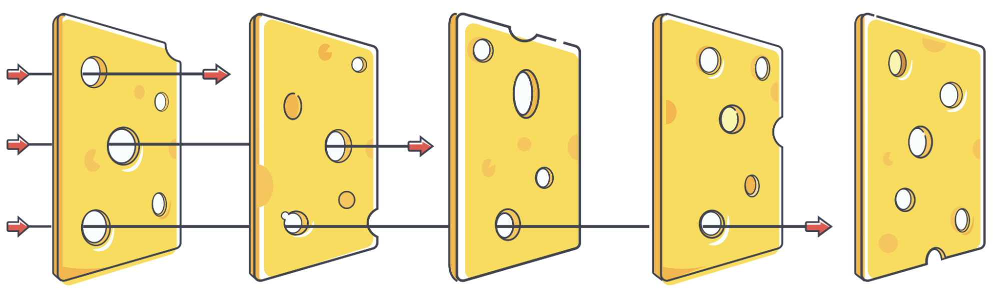
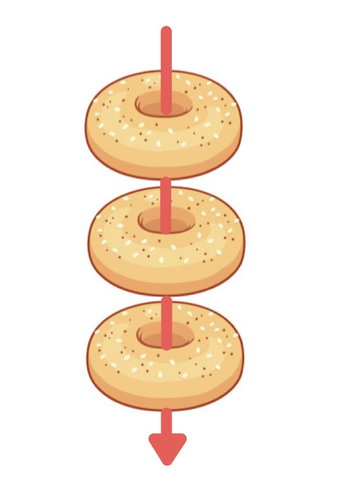

```{r}
library(tidyverse)
source(here::here("icfis/R/simulate_dgp.R"))
```

<!--
TIMING BUDGET — talk is 30 minutes, excluding Q&A. Keep this comment for
rehearsal; delete before final export if desired.

  0:00–0:01  Title / hook
  0:01–0:06  1. Flaws + literature back-and-forth      (~5 min)
  0:06–0:10  2. Flowchart: remediable vs. non-remediable (~4 min)
  0:10–0:16  3. Data-generating process / study design  (~6 min)
  0:16–0:22  4. Case study 1: remediable flaw           (~6 min)
  0:22–0:28  5. Case study 2: non-remediable flaw        (~6 min)
  0:28–0:30  Recommendations / takeaways                 (~2 min)
  ------------------------------------------------------------
  Total: 30:00

RESOLVED: Case study 1 uses inconclusive handling (Flaw D), not CI coverage
(Flaw E) -- built and verified in icfis/case_study_inconclusive.qmd, which
sources the shared DGP in icfis/R/simulate_dgp.R (canonical defaults: maximum-
likelihood fit to the raw Ames II cartridge-case responses, with separate
same-/different-source inconclusive baselines -- see icfis/fit_ames2.qmd; the
earlier shared-baseline calibration is icfis/analysis.qmd). CI coverage
would need a nested firearm random effect the DGP doesn't have yet (see the
"Appendix: planned firearm-clustering extension" backup slide) -- revisit
only if there's time for a second remediable-flaw example.
-->

## Why this talk

- NAS (2009) and PCAST (2016): scientific validity of firearms examination has not been established
- US Context: 
    - Daubert Standard: Is there a **known error rate** for the technique?
- Recent large-scale black-box validation studies have attempted to remedy this (Ames I and II, Hicklin et al)

## Why this talk
- @cuellar2024methodological: literature search of 28 black-box validation studies
  - Found six flaws (A–F) present, with minor exceptions, in **every** study
  - Concluded: the body of existing studies cannot establish scientific validity
- @chin2026towards responded with "Towards Cumulative Forensic Science"
  - Draws on evidence-based medicine / systematic-review practice
  - Argues for a "big team" forensic science: openness, registration, meta-analysis


## The six flaws {.smaller}

::: {.striped}
| Flaw | Description | Cuellar et al. framing |
|---|---|---|
| A | Inadequate sample size | Exacerbates the other flaws |
| B | Non-representative sample (examiners, firearms, ammunition) | Damages the data |
| C | Non-representative testing conditions (contextual bias, known-test effects) | Damages the data |
| D | Inconclusives treated as correct or ignored | Fixable if raw responses available |
| E | Invalid or nonexistent uncertainty measures | Fixable if raw responses available |
| F | Missing data handled inappropriately | Fixable if missingness can be characterized |
: {tbl-colwidths="[8,50,42]"}
:::

## Swiss cheese or bagels?


:::: {.columns}

::: {.column width="60%" .fragment .center}

<br>

<br>

<br>



:::

::: {.column width="40%" .fragment}



:::

::::


<!--
The "Swiss cheese model" says that multiple imperfect studies, when combined, can still produce valid results. 

We argue that these studies are like a set of bagels: they all share the same flaws, and so there's no way to combine them to establish validity
-->

## Where we agree with Chin et al.

- No single study is perfect
- Not every flaw has the same consequences
- Analytic shortcomings may be **repairable after the fact** if the raw
  responses were recorded
- Imperfect studies are still useful!
- We should not discourage data collection just because a study has flaws 

## {.center}

> The problem is not simply that the wrong quantity was reported. The problem is that the data needed to estimate the relevant quantity were never collected in the first place.

## What does it mean for a flaw to be "remediable"? 

- Define the target quantity (the **estimand**)

::: {.definition .fragment}
The population-average error rate (P(Error|Same Source) and P(Error|Different Source)), under casework-representative firearms, ammunition, examiners, and testing conditions.
:::

- A flaw is **remediable** if, given the raw examiner-by-item responses, the estimand can still be estimated correctly (possibly with extra assumptions/new analyses)

- A flaw is **non-remediable** if the sampled data cannot recover the estimand, *regardless* of what analysis is applied to them

## Flowchart: sorting the six flaws



## Remainder of the talk

1. Simulation Framework 

2. Remediable flaw example: Inconclusives

3. Non-remediable flaw example: Non-representative samples

## Approach: simulation study

- We can't go back and observe the "true" error rate for the 28 studies
- A simulation with a **known estimand** lets us show what each flaw does to a study's conclusions
- Same generative model powers both case studies


## Data generating model

- Each item $i$ has a latent difficulty $d_i \sim N(0, \sigma_d^2)$
- Each examiner $j$ has a latent skill $s_j \sim N(0, \sigma_s^2)$ **and** a latent tendency to call items inconclusive $\tau_j \sim N(0, \sigma_\tau^2)$
- Pairing item $i$ with examiner $j$ creates a decision challenge: $c_{ij} = d_i - s_j$
    - this becomes an "offset" from the overall estimand


## Response probabilities {.smaller}

Target estimand: overall population FPR or FNR or IR

The chance of an error and the chance of an inconclusive call on the log-odds scale are both shifted by $c_{ij}$

$$\pi_{ij}^{err} = P(\text{error}) = \text{expit}[\text{logit}(\text{FPR or FNR}) + c_{ij}]$$

$$\pi_{ij}^{inc} = P(\text{Inconclusive}) = \text{expit}[\text{logit}(\text{IR}_{G_i}) + 0.5 \cdot c_{ij} + \tau_j]$$

The baseline inconclusive rate $\text{IR}_{G_i}$ can differ for same-source and different-source items.


## The response, formally {.smaller}

$e(\cdot)$ denotes an error and $c(\cdot)$ denotes a correct response. $G_i$ indicates ground truth (SS or DS)

$$
R_{ij} \mid G_i, c_{ij}, \tau_j \;\sim\; 
\begin{cases}
e(G_i) & \pi^{err}_{ij} \\
\text{inconclusive} & \pi^{inc}_{ij} \\
c(G_i) & 1 - \pi^{err}_{ij} - \pi^{inc}_{ij}
\end{cases}
$$

independently across $(i,j)$ given the latent variables above.


::: {.notes}
~1.5 min. This slide is the payoff of the notation build-up — say the plain-
English version too: "an error, an inconclusive, or a correct call, with
probabilities that shift based on how hard the item is and how skilled the
examiner is." Don't let the audience get lost in the categorical notation.
:::

## Calibrating to real studies {.smaller}

- Probability model above *cannot* capture every effect that arises in real data
- Goal is to create simulated studies that resemble previously-collected results
- Some benchmarks that we used:  
    - Ames II cartridge cases (raw responses): baseline FPR, FNR, and inconclusive rates, fit by maximum likelihood
        - same-source and different-source items get *separate* inconclusive baselines: about 17% vs. 50%
    - Scurich et al (2025) blind-vs-known test inconclusive rates: 39.3% (blind) vs 56.4% (known)
    - Ames II: range of 0-62% "hard" comparison range across individual Beretta pistols

::: {.comment .fragment}
Disagree with these numbers? We have an app for that! [add link]
:::

<!--
Previous calibration (before the raw Ames II data were available): a single
inconclusive baseline shared by same- and different-source items, tuned
against a benchmark reconstructed from @cuellar2024methodological's bounding
algebra for Monson, Smith, and Bajic (2023a) -- see icfis/analysis.qmd. That
version could not reproduce the same-source vs. different-source
inconclusive asymmetry (a ~13-point residual gap in opposite directions);
the maximum-likelihood fit to the raw data (icfis/fit_ames2.qmd) removes it.
-->

::: {.notes}
~1.5 min. This slide doubles as a credibility signal — show the audience
you're not hand-waving the parameters, *and* that you know exactly where
the model still falls short. The baselines are fit by maximum likelihood
to the raw Ames II cartridge-case responses (icfis/fit_ames2.qmd); simulated
studies at these defaults match all six cells of the real decision table to
within about a point, and the SD across examiners of inconclusive rates
(0.24 real, 0.24 simulated).

If pressed on "how well calibrated is this, really?": good on the response
distribution and examiner spread. Known misses: (1) firearm-level variation
-- real same-source inconclusive rates range from 3% to 70% across the 38
firearms, more than the model produces (backup slide candidate); (2) an
examiner's inconclusive tendency behaves differently on same- vs.
different-source items in the real data; (3) item and examiner-skill SD are
NOT identified by this study (each item was seen by one examiner), so those
two defaults are fixed at plausible values (0.8, 0.5), not estimated.
:::

## Ames II: {.smaller}

```{r}
ames2 <- readxl::read_xlsx(here::here("real-data/ames2.xlsx"), sheet = 3) |>
  mutate(
    response_3 = case_when(stringr::str_detect(`Examiner's Analysis`, "Inc") ~ "Inconclusive",
    stringr::str_detect(`Examiner's Analysis`, "ID") ~ "Identification",
    stringr::str_detect(`Examiner's Analysis`, "Elim") ~ "Elimination"
    )
  )

ames2 |>
  select(c("M_NM", "response_3")) |>
  table() |>
  prop.table(1) |>
  round(2) |>
  knitr::kable()
```

### Simulated Data:

```{r}
#| cache: true


# dgp_defaults was fit by maximum likelihood directly to this exact Ames II
# dataset (icfis/fit_ames2.qmd), so simulating at dgp_defaults and comparing
# to Ames II here would be close to circular -- of course it matches almost
# exactly, that's what the fit optimized for. For *this demo only*, blend
# `demo_blend` of the way from the pre-Ames-II-fit legacy defaults (single
# shared inconclusive baseline, from analysis.qmd's earlier calibration
# against a different, reconstructed benchmark -- not fit to this dataset)
# toward the current MLE fit. The case studies elsewhere in the talk are
# unaffected: they still use the full dgp_defaults via incomplete_defaults.
legacy_defaults <- list(
  false_positive_rate = 0.01, false_negative_rate = 0.02,
  inconclusive_rate = 0.36, inconclusive_rate_same = 0.36,
  examiner_skill_sd = 0.7, examiner_inconclusive_sd = 0.35, question_sd = 0.8
)

# Chosen so the pooled proportions below land within ~10 percentage points
# of the real Ames II proportions on every cell (checked separately) --
# "in the right ballpark," not a suspiciously exact match to the data the
# talk's real defaults were fit to. Rates are blended on the logit scale,
# heterogeneity SDs on the log scale, matching how the rest of the talk
# reasons about these parameters.
demo_blend <- 0.3
rate_names <- c("false_positive_rate", "false_negative_rate", "inconclusive_rate", "inconclusive_rate_same")
sd_names <- c("examiner_skill_sd", "examiner_inconclusive_sd", "question_sd")

demo_defaults <- incomplete_defaults
for (n in rate_names) {
  demo_defaults[[n]] <- plogis((1 - demo_blend) * qlogis(legacy_defaults[[n]]) + demo_blend * qlogis(dgp_defaults[[n]]))
}
for (n in sd_names) {
  demo_defaults[[n]] <- exp((1 - demo_blend) * log(legacy_defaults[[n]]) + demo_blend * log(dgp_defaults[[n]]))
}

one_study <- generate_sim_data_incomplete(
  seed = 1,
  n_examiners = demo_defaults$n_examiners,
  n_comparisons = demo_defaults$n_comparisons,
  items_per_examiner = demo_defaults$items_per_examiner,
  match_rate = demo_defaults$match_rate,
  false_positive_rate = demo_defaults$false_positive_rate,
  false_negative_rate = demo_defaults$false_negative_rate,
  inconclusive_rate = demo_defaults$inconclusive_rate,
  inconclusive_rate_same = demo_defaults$inconclusive_rate_same,
  examiner_skill_sd = demo_defaults$examiner_skill_sd,
  examiner_inconclusive_sd = demo_defaults$examiner_inconclusive_sd,
  question_sd = demo_defaults$question_sd
)

# 100 replicate studies, seed 1 through 100 (seed 1 is the same study shown
# on the left), pooled -- i.e., proportions computed from all ~150,000
# combined responses, not an average of 100 per-study proportions -- to
# match how the real-data table above (one large pooled table) is computed.
studies_100 <- purrr::map_dfr(1:100, function(s) {
  generate_sim_data_incomplete(
    seed = s,
    n_examiners = demo_defaults$n_examiners,
    n_comparisons = demo_defaults$n_comparisons,
    items_per_examiner = demo_defaults$items_per_examiner,
    match_rate = demo_defaults$match_rate,
    false_positive_rate = demo_defaults$false_positive_rate,
    false_negative_rate = demo_defaults$false_negative_rate,
    inconclusive_rate = demo_defaults$inconclusive_rate,
    inconclusive_rate_same = demo_defaults$inconclusive_rate_same,
    examiner_skill_sd = demo_defaults$examiner_skill_sd,
    examiner_inconclusive_sd = demo_defaults$examiner_inconclusive_sd,
    question_sd = demo_defaults$question_sd
  )
})
```


```{r}
one_study |>
  mutate(
    ground_truth_label = factor(
      str_to_title(ground_truth_label),
      levels = c("Same-Source", "Different-Source")
    ),
    gt_label = ifelse(ground_truth_label == "Same-Source", "M", "NM"),
    response = str_sub(str_to_title(response), 1, 4)
  ) |>
  select(gt_label, response) |>
  table() |>
  prop.table(1) |>
  round(2) |>
  knitr::kable()
```


# Case Study 1: A Remediable Flaw

## Setup: inconclusive handling (Flaw D)

[add table]

- Black-box studies handle inconclusive responses inconsistently
- @cuellar2024methodological recommend a bounding procedure instead: recode
  every inconclusive as an identification, then as an elimination, and
  report **both** recomputed error rates as a range
- Claim: this flaw is *remediable* — both numbers come from the same raw
  responses, recomputed after the fact


## Simulation design

- Same DGP as earlier, under an incomplete design (50 examiners, 30 of 300 items each)
- For each simulated study, compute both numbers from the same raw
  responses:
  - **Reported**: identifications / all different-source cases (and the
    same-source analog for the false negative rate)
  - **Worst case**: recode every inconclusive as the error-favoring label,
    recompute
- Repeat across 100 replicate studies

::: {.notes}
~1.5 min.
:::

## Results

- Across 100 replicate studies (means): 
    - FPR **0.9% → 50.7%**, 
    - FNR **1.7% → 25.4%** 
- The real Ames II cartridge-case responses give the same picture: 
    - FPR **0.9% → 51.5%**
    - FNR **1.8% → 25.7%**

::: {.notes}
~2 min. Lead with the one-study numbers (concrete, easy to say out loud),
then the 100-study means as the "this isn't a fluke" follow-up. The boxplot
figure should show both distributions barely overlapping.

The real-data bullet is a realism check, not independent evidence: the
simulation's defaults were fit to those responses. The point is that the
simulated gap is the size of the gap in an actual published study. The
asymmetry (larger gap for false positives) comes from inconclusives being much
more common on different-source items (about 50%) than same-source (about 23%).
:::

## Results

[build this up: raw numbers, add the X's, add the intervals]

```{r inconclusive-bounds-figure}
#| fig-width: 9
#| fig-height: 6
# Data: icfis/data/inconclusive_bounds.csv, written by icfis/case_study_inconclusive.qmd
# ("Before and after reporting bounds"): means over 100 simulated studies per setting.
bounds_data <- read_csv(here::here("icfis/data/inconclusive_bounds.csv"), show_col_types = FALSE) |>
  mutate(
    setting = fct_reorder(setting, scale),
    rate = factor(rate, levels = c("False positive rate", "False negative rate"))
  )

panel_levels <- c("No bounds", "With bounds")
x_label <- "True rate"

points_long <- bounds_data |>
  select(setting, rate, Reported = reported, !!x_label := truth_low) |>
  pivot_longer(c(Reported, all_of(x_label)), names_to = "measure", values_to = "value") |>
  crossing(panel = panel_levels) |>
  mutate(panel = factor(panel, levels = panel_levels))

brackets <- bounds_data |> mutate(panel = factor(panel_levels[2], levels = panel_levels))

ggplot(points_long, aes(x = setting)) +
  geom_errorbar(
    data = brackets, aes(ymin = reported, ymax = worst_case),
    width = 0.18, linewidth = 0.9, color = "#0072B2"
  ) +
  geom_point(aes(y = value, shape = measure, color = measure), size = 3.5, stroke = 1.4) +
  facet_grid(panel ~ rate) +
  scale_shape_manual(values = setNames(c(16, 4), c("Reported", x_label))) +
  scale_color_manual(values = setNames(c("#0072B2", "#D55E00"), c("Reported", x_label))) +
  scale_y_continuous(labels = scales::percent_format(accuracy = 1)) +
  labs(
    title = "",
    subtitle = "",
    x = "Baseline inconclusive rates",
    y = "Error rate", shape = NULL, color = NULL
  ) +
  theme_minimal(base_size = 13) +
  theme(legend.position = "bottom")
```

::: {.notes}
Figure code is in this slide's chunk; data are icfis/data/inconclusive_bounds.csv, written
by icfis/case_study_inconclusive.qmd ("Before and after reporting bounds"). x-axis: overall inconclusive rate, scaled 0.3x / 0.6x / 1x from the
Ames II fit. Dot = reported rate (barely moves). Blue bracket = reported to worst
case, the only thing a study can claim without further assumptions.

The X is a *scenario* true rate: the DGP has no forced-choice decision, so we use
the examiners' own Ames II subcategories as a proxy. Among different-source
inconclusives, 12% lean toward identification (Inc-A, the error direction); among
same-source, 7% lean toward elimination (Inc-C). X = reported + that share x the
inconclusive share, i.e. the true rate if only the inconclusives leaning toward
the error had been errors. That is a floor: undetermined (Inc-B) inconclusives
(44% / 41% of them) could also come out wrong, so h could be as high as 57% / 48%.
These are examiners' labels, not verified forced choices. Ames II recorded them; most studies don't, so most studies can't
be analyzed this way.
:::

## Why this counts as remediable

- The fix required **no new data collection**. Only how they're summarized changed
- A study with
  this flaw alone can still contribute to a cumulative evidence base, *once
  reanalyzed*
- On the other hand, these intervals are so large that this isn't really a "solution"
    - More research is needed: "forced choice" reporting, blind test cases, Hawthorne effect, etc. 

# Case Study 2: A Non-Remediable Flaw

## Setup: non-representative sampling (Flaw B)

- Precondition for validity: firearms, ammunition, and examiners must
  represent the **full spectrum of real casework** [@cuellar2024methodological]
- None of the 28 studies demonstrate this
- Chin et al.'s response: non-representative samples can still contribute to
  a cumulative literature if combined with other studies 


## Ames II (bullets)

- 11 Ruger and 27 Beretta firearms were used to generate test cases
- Beretta had *fewer* inconclusives on ground truth same-source, and *more* inconclusives on ground truth different source
- Support for a "type" effect

```{r}
ames2 |>
  pivot_longer(c(Gun_1, Gun_2), names_to = "index", values_to = "individual_firearm") |>
  group_by(Ber_NonBer, M_NM) |>
  summarize(
    pct_inc = mean(response_3 == "Inconclusive", na.rm = TRUE),
    pct_id = mean(response_3 == "Identification", na.rm = TRUE)) |>
  knitr::kable(digits = 2)
```

## Ames II: individual firearms

Some firearms are more/less likely to have certain responses: support for individual firearm effect

```{r}
#| fig-width: 10
#| fig-height: 5
ames2_long <- ames2 |>
  pivot_longer(c(Gun_1, Gun_2), names_to = "index", values_to = "individual_firearm") |>
  mutate(individual_firearm = fct_reorder(
    individual_firearm, response_3 == "Inconclusive", .fun = sum, .desc = TRUE, .na_rm = FALSE
  ))

# Overall % inconclusive within each facet (pooled over responses). `%in%`
# rather than `==` so the ~1% missing responses stay in the denominator,
# matching the bars (geom_bar counts NA as its own fill category).
pct_inc <- ames2_long |>
  group_by(Ber_NonBer, M_NM) |>
  summarize(pct_inc = mean(response_3 %in% "Inconclusive"), .groups = "drop")

ames2_long |>
  ggplot(aes(x = individual_firearm, fill = response_3)) + 
  geom_bar(position = "fill") + 
  geom_hline(data = pct_inc, aes(yintercept = pct_inc), linetype = "dotted", linewidth = .8, col = "white") +
  # geom_label(
  #   data = pct_inc,
  #   aes(x = Inf, y = pct_inc, label = paste0("avg: ", scales::percent(pct_inc, accuracy = 1))),
  #   inherit.aes = FALSE, hjust = 1, fill = "white", fontface = "bold", size = 3.5
  # ) +
  facet_grid(cols = vars(Ber_NonBer), rows = vars(M_NM), scales = "free_x") + 
  scale_fill_viridis_d(option = "plasma", end = .8) + 
  theme(legend.position = "top") + 
  labs(fill = "", y = "Proportion of responses")
  
```

::: {.notes}
Build up this graph: show that there's firearm make/model variability by comparing Ber/NonBer and then highlight the individual firearm variability
:::

## Two levels of variability

- Different firearm makes/models have different baseline difficulties
    - **Simulation:** choose 8 types

- Individual firearms *within* a make/model also have different difficulties
    - **Simulation:** assume a difficulty distribution for each firearm type; draw individual firearms from that distribution

- Every scenario below draws 80 individual firearms total, spread across
  however many types are included
    - Ames II: used ~38 (27 Beretta, 11 non-Beretta)

::: {.notes}
Last bullet point: some people have misunderstood our point and think that we are asking for *every single* firearm/ammunition/examiner combination to be fully characterized with a population error rate. That's not the case: it might be possible to get an estimate of a population error rate with a relatively small number of guns, if they are chosen appropriately. 
:::

## Three different "study" approaches:

1. **Biased estimate.** A convenience sample restricted to only two types (21% of casework by weight), 40 firearms each (80 total)
2. **The fix that could work.** A hypothetical better study covering all
   eight types (10 firearms each, not in population-correct
   proportions) with type recorded as a covariate
3. **The fix that doesn't require new data.** Applying that same reweighting to the
   *actual* convenience sample from (1), which has zero data on the six
   unsampled types.

::: {.notes}
~2 min. This is the slide to get right — beat 2 is what keeps this honest
(we're not claiming reweighting is impossible in principle), beat 3 is what
makes it non-remediable *for the existing studies*. The two-level design
(types, then firearms within type) mirrors how an actual black-box study
is built. Total firearm count is held equal (80) across all three beats
on purpose — an earlier version held firearms-*per-type* equal instead (5
each), so the convenience sample used only 10 firearms total against the
full-coverage study's 40; equalizing the total rules out "beat 1 is just a
smaller study" as the explanation for its bias. Each examiner also sees
only a subset of a scenario's items (30, same as case study 1), not every
item — an earlier version had every examiner see every item.
:::

<!-- 
## Results

500 replicate studies per scenario. True population rate: **FPR 1.55%, FNR 2.76%**.

- Convenience sample (naive): FPR **0.19%**, FNR **0.38%** — roughly
  **7–8x too low** on both
- Full-coverage study, reweighted: FPR **1.40%**, FNR **2.50%** — within
  ~9% of truth on both — reweighting works, even with only 10 firearms
  sampled per type
- Convenience sample, "reweighted": FPR **0.21%**, FNR **0.42%** — barely moved from the original convenience sample
 -->

## Reweighting the convenience sample doesn't work

```{r nonrep-bias-figure}
#| fig-width: 11
#| fig-height: 6
# Data: icfis/data/sensitivity_nonrepresentative_grid.csv, written by
# icfis/sensitivity_nonrepresentative.qmd (`grid_results`): one row per
# heterogeneity setting x scenario x metric, summarizing `n_studies` simulated studies.
nonrep_grid <- read_csv(here::here("icfis/data/sensitivity_nonrepresentative_grid.csv"), show_col_types = FALSE)

nonrep_scenarios <- c(
  "Convenience sample (naive)",
  "Convenience sample (\"reweighted\")",
  "Full-coverage study (reweighted)"
)
nonrep_colors <- c(
  "Convenience sample (naive)"          = "#D55E00",
  "Convenience sample (\"reweighted\")" = "#0072B2",
  "Full-coverage study (reweighted)"    = "#009E73"
)

nonrep_grid |>
  filter(scenario %in% nonrep_scenarios) |>
  mutate(
    scenario = factor(scenario, levels = nonrep_scenarios),
    difficulty_scenario = factor(difficulty_scenario, levels = c("Low", "Medium", "High")),
    examiner_scenario = factor(examiner_scenario, levels = c("Low", "Medium", "High")),
    metric = factor(metric, levels = c("FPR", "FNR")),
    diff = mean_rate - true_rate,          # bias: estimate minus the true population rate
    diff_lo = q025 - true_rate,            # 2.5th-97.5th percentile across individual studies
    diff_hi = q975 - true_rate
  ) |>
  ggplot(aes(x = examiner_scenario, y = diff, color = scenario)) +
  geom_hline(yintercept = 0, linetype = "dashed", color = "grey50") +
  geom_pointrange(
    aes(ymin = diff_lo, ymax = diff_hi),
    position = position_dodge(width = 0.5), size = 0.5
  ) +
  facet_grid(
    metric ~ difficulty_scenario,
    labeller = labeller(difficulty_scenario = function(x) paste("Difficulty:", x))
  ) +
  scale_y_continuous(labels = scales::percent_format(accuracy = 1)) +
  scale_color_manual(values = nonrep_colors) +
  labs(
    x = "Examiner heterogeneity",
    y = "Estimated rate - true rate",
    color = NULL,
    subtitle = paste0(
      "Points: mean over ", unique(nonrep_grid$n_studies), " simulated studies. ",
      "Bars: 95% interval across individual studies."
    )
  ) +
  theme_minimal(base_size = 15) +
  theme(legend.position = "bottom")
```

::: {.notes}
Figure code is in this slide's chunk; data are icfis/data/sensitivity_nonrepresentative_grid.csv,
written by icfis/sensitivity_nonrepresentative.qmd. Each panel is one setting of how much
firearm types/individual firearms differ in difficulty (columns) and how much examiners
differ (x-axis); rows are FPR and FNR. y = estimated rate minus the true population rate,
so 0 (dashed) is perfect. Red = convenience sample, no correction; blue = the same
sample reweighted by population share (sits right on top of red: reweighting can't
help, there is no data on most of the population); green = a study covering all eight
types, reweighted (centered on zero, though noisy). Bars are where 95% of individual
studies land.
:::


## Why this counts as non-remediable

- No statistical procedure applied to *this* dataset can recover the
  population-average estimand 
- Fixing it requires **new data** collected under a design that
  characterizes the target population — not a different analysis of the
  same responses

::: {.notes}
~1 min.
:::

# Conclusion

## Flowchart, again



## Takeaways

- Not all six flaws are alike — sorting them by *remediable vs. non-remediable*
  clarifies exactly where Chin et al.'s cumulative-science argument applies
- **Remediable** (A, D, E, and F with assumptions): reanalysis of existing
  data, or combining data from multiple studies, can recover a valid estimate 
- **Non-remediable** (B, C): the target quantity was never within reach of
  the sampled data 

::: {.notes}
~1 min.
:::

## Recommendations

- Report raw, examiner-by-item responses (not just summary error/inconclusive rates) 
    - enables post-hoc correction of remediable flaws
- Pre-register sampling frames
    - characterize the target population of firearms / examiners *before* data collection
- Use cluster-aware / MRMC statistical methods designed for the dependence structure of validation studies


::: {.notes}
~1.5 min.
:::

## Thank you

::: {.nonincremental}
- Amanda Luby `aluby@carleton.edu`
- Maria Cuellar `mcuellar@sas.upenn.edu`
- Code and simulations: `github.com/mariacuellar/validity-firearms`
:::

<!-- TODO: confirm repo URL / visibility before the talk -->

::: {.notes}
~0.5 min. Leave this slide up through Q&A.
:::

## References {.smaller}

::: {#refs}
:::

# Backup Slides

<!-- Not in the 30-minute budget — pull these up only if asked. -->

## Appendix: contextual-bias extension (Flaw C) {.smaller}

Hawthorne shift, calibrated to Scurich et al. (2025) blind vs. known-test
inconclusive rates at the Houston Forensic Science Center:

$$
\delta_H = \operatorname{logit}(0.564) - \operatorname{logit}(0.393)
$$

Under the "known test" condition, the inconclusive-probability equation
gains one term (error probability is unaffected):

$$
\pi^{inc}_{ij}(\text{condition}) = \operatorname{expit}\Big[\operatorname{logit}(p_{IC}) + 0.5\,c_{ij} + \tau_j + \delta_H \cdot \mathbb{1}\{\text{condition} = \text{"known test"}\}\Big]
$$

::: {.notes}
Backup only. Use if asked why the FPR/FNR barely moved between conditions
in the case-study-2 exploratory run — the shift is currently uniform across
easy and hard items, which is exactly why it doesn't move conclusive-only
error rates much. That's a modeling choice worth revisiting, not a result.
:::

## Appendix: missingness extension (Flaw F) {.smaller}

$$
\text{is\_error}_{ij} = \mathbb{1}\{R_{ij} = e(G_i)\}
$$

$$
\pi^{miss}_{ij} = \operatorname{expit}\Big[\operatorname{logit}(0.05) + 0.8\,c_{ij} + 1.2\cdot\text{is\_error}_{ij} + 0.6\cdot\mathbb{1}\{R_{ij}=\text{"inconclusive"}\}\Big]
$$

$$
M_{ij} \sim \text{Bernoulli}(\pi^{miss}_{ij}), \qquad
R^{obs}_{ij} = \begin{cases} R_{ij} & M_{ij} = 0 \\ \texttt{NA} & M_{ij} = 1 \end{cases}
$$

A missing-not-at-random mechanism: harder pairs, errors, and inconclusives
are all more likely to drop out, which is what biases naive (listwise-
deletion) error rates downward.

::: {.notes}
Backup only.
:::

## Appendix: what's left for CI coverage (Flaw E) {.smaller}

The individual-firearm random effect itself is **already built and in
use** — `make_firearm_population()` in `icfis/R/simulate_dgp_types.R`
gives each type $K$ individual firearms $k = 1, \dots, K$, each with
$f_k \sim N(0, \sigma_F^2)$, and case study 2 draws from it (40 or 10
firearms per included type, depending on the scenario, for the same 80
firearms total). What's *not* built is using that structure for CI
coverage:

- Case study 2 uses the firearm layer for a **bias** demonstration
  (does reweighting recover the population mean?) — it never constructs
  a confidence interval
- A Flaw E case study needs the same nested structure feeding an actual
  **interval-coverage** comparison: simulate many studies from a known
  true rate, compute a 95% CI three ways per study (naive Clopper–Pearson,
  cluster-robust, Gallas et al. 2009-style MRMC), and check what fraction
  of intervals actually contain the truth
- Responses for items sharing a firearm are **dependent** given $f_k$ —
  exactly what a naive interval ignores and a cluster-robust one accounts
  for; this is a different question from case study 2's, even though the
  generative structure is shared

::: {.notes}
Backup only — this is the concrete build item to report progress on if
asked "what's left to do." Don't say "not implemented" for the firearm
effect itself — it is; what's missing is the CI-coverage simulation loop
on top of it.
:::

## Appendix: is the "5x" just an artifact of our parameters? {.smaller}

Case study 2's `type_difficulty_sd`, `firearm_difficulty_sd`, and
`examiner_skill_sd` are uncalibrated. Checked a 3×3 grid (difficulty
heterogeneity × examiner heterogeneity, each Low/Medium/High; 50 replicate
studies per cell) — see `icfis/sensitivity_nonrepresentative.qmd`.

- **Bias ratio scales strongly with difficulty heterogeneity**: convenience
  sample is ~3x too low at Low, ~5–8x at Medium (the main case study's
  defaults; this grid's own Medium/Medium point lands at ~6x, at this
  grid's coarser 50-replicate precision — the main case study's
  500-replicate run gives ~8x), ~11–18x at High
- **Examiner (skill) heterogeneity has no consistent effect** — much smaller
  than the range difficulty heterogeneity produces, and not always in the
  same direction
- **The qualitative story holds at all 9 settings tested**: full-coverage
  reweighted stays within 0.79x–1.25x of truth everywhere; convenience
  "reweighted" never climbs out of 0.06x–0.41x
- **Conclusion**: the specific multiplier ("~8x") is not an empirical claim
  — it moves with unvalidated assumptions. The *direction* and the
  reweighting-works/fails distinction don't.

::: {.notes}
Backup only. Pull this up if asked "isn't 8x just an artifact of your
parameter choices?" — yes, the number is; the direction and mechanism
aren't. That's the whole slide in one sentence if time is short.
:::
